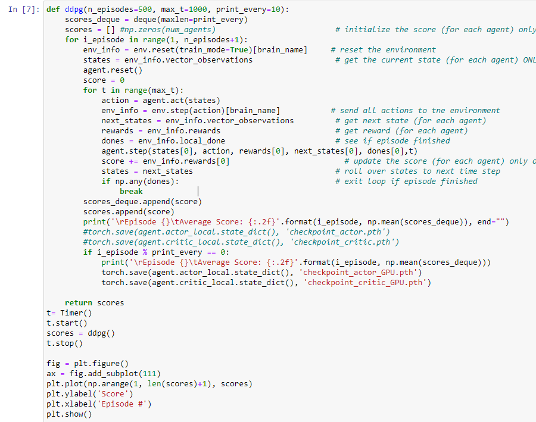
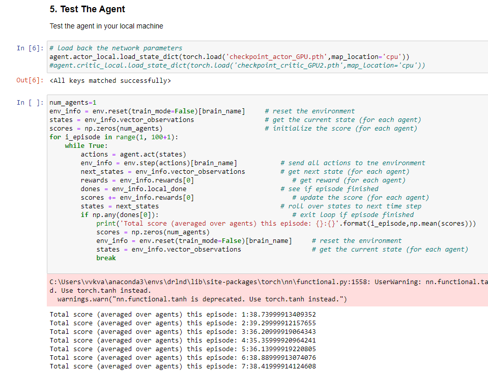

# Project: Continous Control with Reinforcement Learning

### Introduction

This challenge is a continuous control problem where the agent must reach a moving ball with a double jointed arm. A reward
of +0.1 is provided for each time step that the arm is in the goal position thus incentivizing the agent to be in contact
with the ball. The observation space consists of 33 variables corresponding to position, rotation, velocity, and angular
velocities of the arm. Each action is a vector with four numbers, corresponding to torque applicable to two joints. Every
entry in the action vector should be a number between -1 and 1. For the purpose of this project, a single agent is trained to perform this activity to achieve an average score of +30 from over 100 consecutive episodes.

For this project, you will work with the [Reacher](https://github.com/Unity-Technologies/ml-agents/blob/master/docs/Learning-Environment-Examples.md#reacher) environment.

The steps below will describe how to setup and train a **single agent** version in Unity environment.

### Getting Started
#### Requirement installation
- [Unity ML-Agents](https://github.com/Unity-Technologies/ml-agents/blob/master/docs/Installation.md)
- [NumPy](http://www.numpy.org/)
- pip install -r requirement.txt

1. Download the environment from one of the links below.  You need only select the environment that matches your operating system:

    - **_Version 1: One (1) Agent_**
        - Linux: [click here](https://s3-us-west-1.amazonaws.com/udacity-drlnd/P2/Reacher/one_agent/Reacher_Linux.zip)
        - Mac OSX: [click here](https://s3-us-west-1.amazonaws.com/udacity-drlnd/P2/Reacher/one_agent/Reacher.app.zip)
        - Windows (32-bit): [click here](https://s3-us-west-1.amazonaws.com/udacity-drlnd/P2/Reacher/one_agent/Reacher_Windows_x86.zip)
        - Windows (64-bit): [click here](https://s3-us-west-1.amazonaws.com/udacity-drlnd/P2/Reacher/one_agent/Reacher_Windows_x86_64.zip)

    (_For Windows users_) Check out [this link](https://support.microsoft.com/en-us/help/827218/how-to-determine-whether-a-computer-is-running-a-32-bit-version-or-64) if you need help with determining if your computer is running a 32-bit version or 64-bit version of the Windows operating system.

2. get code from github [link](https://github.com/davincizhao/Continuous_Control_reacher)

3. Run "jupyter notebook Continuous_Control.ipynb"

### Instructions

Follow the instructions in `Continuous_Control.ipynb` to get started with training your own agent!  

 **1. Setup the unity environment by run the unit, if environment is ok, there are all information about this environment will be print out**

 **2. Examine the State and Action Spaces**

 **3. Load the DDPG model** 

 **4. Configure the hyperparameters and train the DDPG agent. for example setting the training episodes to 600, maximum training time step to 300.**

 **5. Finally, save the model weights of the agent,when the agent achieves an average score of +30 from over 100 consecutive episodes. using the torch.save() function**

 **6. Test the agent in your local machine**

